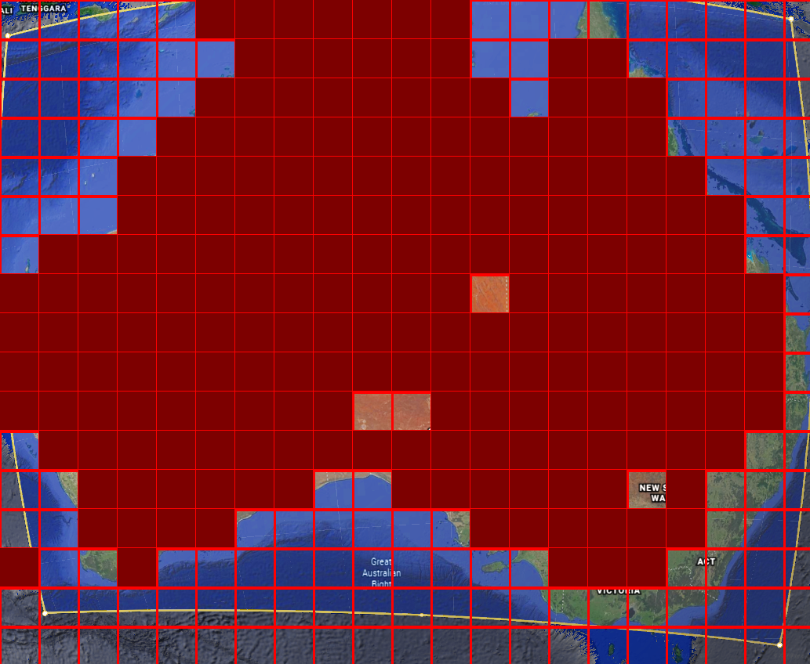

# Experimentally Proving the Minkowski-Bouligand Box Counting Method with the Coastlines of Great Britain and Australia 

## Applied Skills:
* Applying OpenCV and working with greater than 3 dimensional tensors
* Creating Aesthetically Pleasing Papers in LaTeX
* Scientific Method

Through the use of image processing, using OpenCV, the Minkowski Box-counting method is experimentally
proven by comparing the measured Dimension of the coastline of Great Britain and Australia to
the correct value found and agreed upon by other researchers. The results were measured by using
the amount of enclosed boxes as a measurement of approximation and comparing it to the percent
error between the measured Dimension and the Theoretical Dimension.

## Fractals and Fractal Dimension
A core differentiator between objects made from nature and objects made from man is level at which
similar patterns repeat at different scales. The fractal itself is a shape that exhibits repeating pat-
terns at any scale from which you view it. 

However, a problem arises when trying to measure the lengths of fractal objects. When one zooms
into a fractal, such as the Mandlebrot set, the patterns repeat themselves infnitely. This means
that an attempt to accurately measure the length of these shapes would result in an infnite perimeter
which isn't useful.

Instead, fractals are measured by their roughness, a non-integer dimension This can be cal-
culated using the Minkowski Box counting method: a mathematical approximation of the dimension
using boxes at different scales and logarithms.

Where the **Dimension** = log(Amount of Boxes) / log (Scale of each box)

## Experiment
* An image of a continent or country is downloaded from Google Earth or Google Maps.

* A Python program then draws a grid, with each square being of a certain size on the image, and
then counts and displays the number of squares that bound the landmass. 

* An accurate length of one square is then measured using Google Earth. 
* The amount of squares that enclose the landmass is recorded by the program.
 * A spreadsheet then takes the logarithm of the length of each square and divides it by the logarithm
of the box count to obtain the empirical dimension. This is repeated with 5 scales of different box
lengths.

## Analysis of Results
The number of boxes used is generally inversely proportional to accuracy up to a certain point: the
point at which the Minkowski Box Counting formula converges to a single dimension. For the Great
Britain graph, this occurs at around 110 boxes, 40-50 kilometers in length, and for the Australia graph
at around 340 boxes, 150 kilometers in length.

Possible sources of error include inaccuracy in measuring the length of the boxes on Google Earth or a
miscalculation in counting the number of boxes used. The program used to automate the calculation
process uses a rudimentary image processing technique of comparing the average amount of green
pixels to blue pixels which often leaves out a few unwanted boxes. The images themselves were also
screenshots of Google Earth that that included white titles for each country that also likely added to
the inaccuracy.

It's a strange to think about certain objects in nature, that can be physically held in the three dimen-
sions of space, yet at the same time exist in a fractional dimension themselves. Through the experiment,
the Minkowski-Bouligand Box counting method was proven experimentally with the hypothesis which
further proves how Fractal dimension remains a powerful measurement.

## Okay, Cool, but How's any of this useful?

The most useful part of Fractal dimension is that is allows for the measurement of roughness. Rough-
ness is an important natural measurement that can be used to compare the trees of different ecological
systems, the health of bronchi in a patient's lungs, or the quality of snow
akes affected by pollution
in a region.
Imagine a candy company owner wants to test out the taste of a new candy bar in comparison to
his competitors' products. A study could be set up using unlabeled candy bars given to participants,
and a hypothesis could be formed of how the smoothness of a candy bar affects its taste. Fractal
dimension would be used to compare the roughness of the different candy bars and see which one holds
the better taste.
Perhaps an ecologist wants to compare the trees in the African Savanna to the trees in the Ama-
zon Forest. Trees, are by nature fractal as they infnitely repeat their branching patterns, and the
roughness of different trees could reveal important qualities about the environment from which they're
grown. If the trees in the Amazon were found to have more roughness than the trees in the African
Savanna, then that would shed light on the effects of certain types of pollution in those areas.
The possibilities of application are endless, and all it takes is a creative, observant mind to benefit
the world using this measurement tool.
